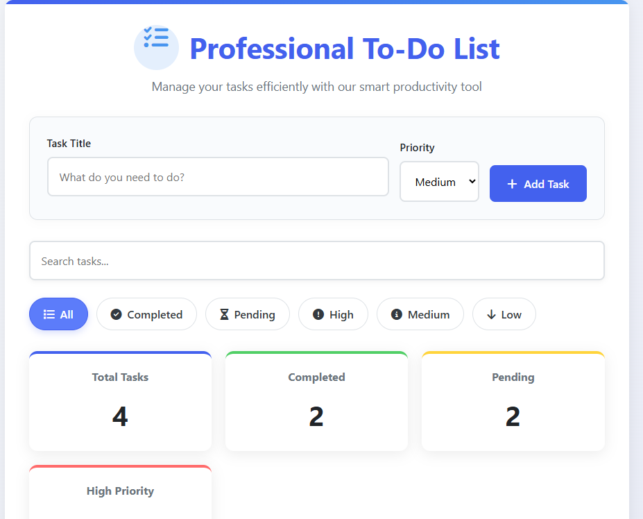
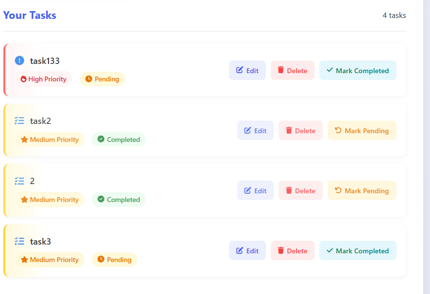

# ✅ Professional Smart To-Do List

A feature-rich task management application with priority levels, filtering, and persistent storage.

## ✨ Features
- Add/Edit/Delete tasks
- Priority levels (High/Medium/Low)
- Task completion tracking
- Search functionality
- Filter by status/priority
- Dashboard statistics
- Local storage persistence
- Responsive design
- Animated transitions

## 🛠️ Tech Stack
- **HTML5** - Application structure
- **CSS3** - Modern UI with gradients and animations
- **JavaScript** - Task management logic
- **Font Awesome** - Icons
- **LocalStorage** - Data persistence

## 🚀 How to Use
1. Add tasks with title and priority
2. Use action buttons to edit/delete tasks
3. Mark tasks as complete/pending
4. Filter tasks using the filter bar
5. Search through tasks
6. View statistics in dashboard

## 🔍 Key Concepts Implemented
- CRUD operations
- Local storage management
- DOM manipulation
- Event delegation
- Data filtering/searching
- Responsive grid layout
- CSS animations

## 📸 Preview

*Dashboard and task input*

*Task list with filtering options*

---

*Created for CodeAlpha Web Development Internship*  

